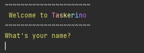
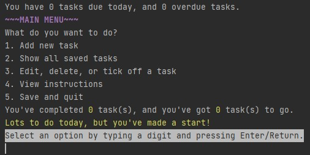
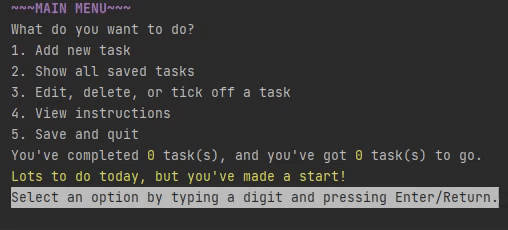
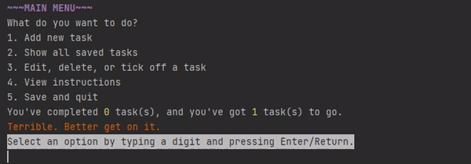
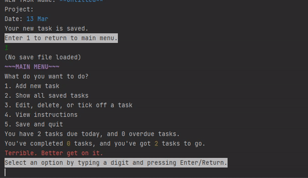
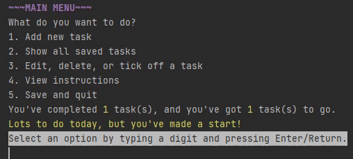
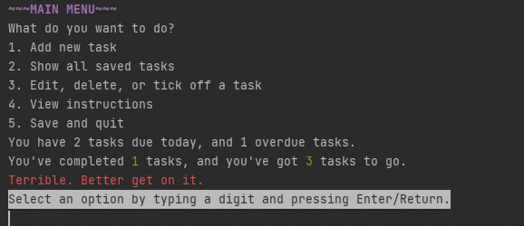
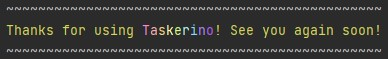

# Taskerino
A To-Do List app written in Java called Taskerino.

This command line application stores user-generated tasks as a to-do list. The user can add tasks with a Name, Project, 
and Due date, edit, tick off, or delete their tasks. Tasks can be displayed sorted by project, date, or ticked status.

Tasks can be saved to text file on exit and loaded on next program execution.


## Getting started
This application can be run directly through Gradle or through a generated jar file.

### Run with Gradle
In the root folder, start application with Gradle's run command.

```bash
gradle run
```

### Run with jar file
Generate the jar file with Gradle's build command.
```bash
gradle build
```
The jar file will be generated in `build/libs` which can be run by a Java environment.


```bash
java -jar apps/build/libs/app.jar
```

**NOTE:** Running using `gradle build` or `java -jar app.jar` will not allow saving/loading from file, and text format 
may appear differently. Author strongly recommends running Taskerino through IntelliJ terminal for best results.

## Usage


Running the app will present a welcome message, and prompt you to enter your name. The Main menu will then be printed,
and you can add some tasks to your to-do list by selecting Add Task. At the bottom of the menu, you will get an overview 
of any overdue tasks or tasks due today, as well as a tally of how many tasks you've completed.

Main menu still image:




When adding a task, you will be prompted to enter a task Name, Project, and Due date. This GIF shows entering a task 
with some information.



If you choose not to enter any information, the task name is set to Untitled, project will remain blank, and Due date 
is set to today's date.



You can edit your task to change the information stored, mark it as complete, or delete it. After entering the Edit 
menu, Taskerino will display all your stored tasks. Choose one to edit by entering its corresponding number as shown below.



In the Show Tasks menu, you can sort your tasks by project, by due date, or by unticked / ticked off status (complete 
or incomplete).



When you are finished, exit the program by selecting Save and quit. This will save your to-do list to a text file in 
the resources folder.





##Javadocs

Generate Javadocs .html files by navigating to /app/src/main/java and running javadoc command.

```bash
javadoc taskerino
```

## Author
Fiona Thompson

Created between Feb 22 and Mar 19 2021 for an assignment from Software Development Academy, iteration 9.

Note: GIFS were created from mp4 using
https://ezgif.com/video-to-gif