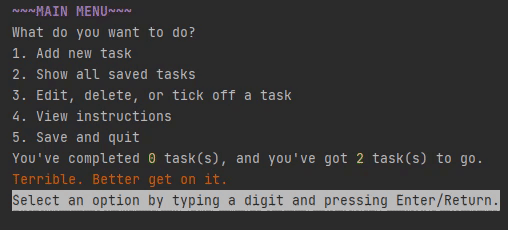

# taskerino
A To-Do List app (in progress) written in Java called taskerino.

This application should store tasks as a To-Do list.


## Getting started
This application can be run directly through Gradle or through a generated jar file.

### Run with Gradle
In the root folder, start application with Gradle's run command.

```bash
gradle run
```

### Run with jar file
Generate the jar file with Gradle's build command.
```bash
gradle build
```
The jar file will be generated in `build/libs` which can be run by a Java environment.


```bash
java -jar apps/build/libs/app.jar
```

**NOTE:** Running using `gradle build` or `java -jar app.jar` will not allow saving/loading from file, and text format may appear 
differently.

## Usage
You can add tasks you want to store in your list.

Main menu still image:


Adding a task with information, and adding a task with no information:


Editing a task:



Showing saved tasks:


Saving to file, and exit:


## Author
Fiona Thompson

mp4 to GIF conversion:
https://ezgif.com/video-to-gif 

PowerPoint screen record